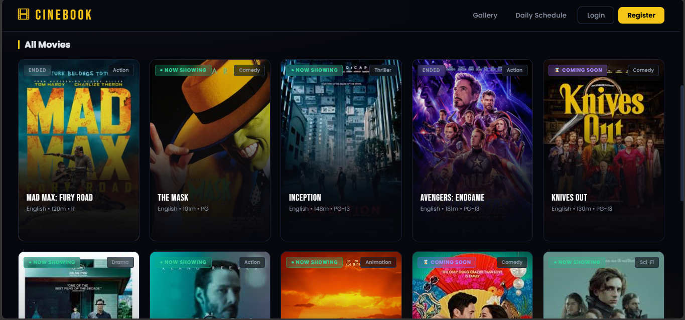
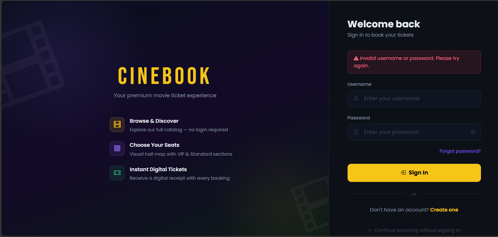
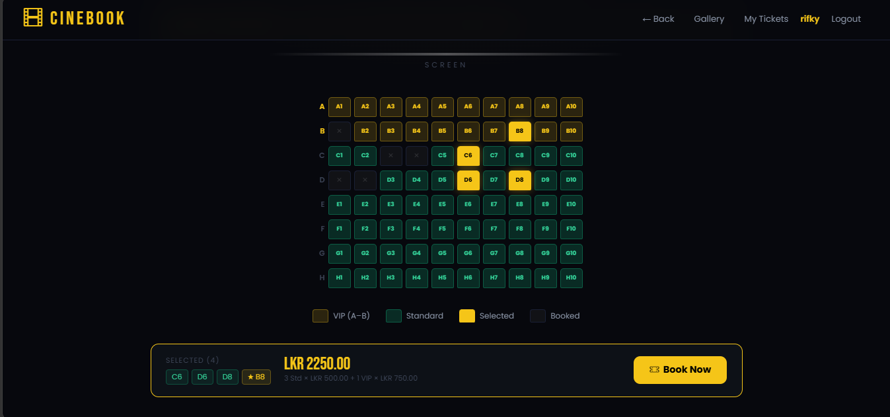
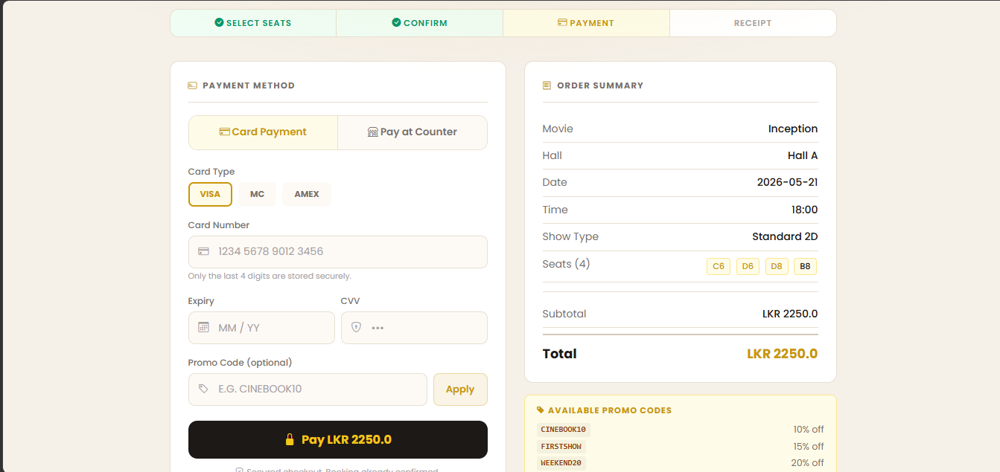

# CineBook 🎬

[](https://www.oracle.com/java/)
[](https://spring.io/projects/spring-boot)
[](https://www.oracle.com/java/technologies/jspt.html)
[-yellow.svg)](#7-file-handling--data-persistence-strategy)
[](https://www.sliit.lk/)

A lightweight, high-performance, web-based movie ticket reservation and theater management system built using **Java Spring Boot** and **JavaServer Pages (JSP)**. 

CineBook implements modern enterprise software design patterns (MVC) and strictly applies Object-Oriented Programming (OOP) principles to achieve reliable, transactionally stable data persistence using structured text files (`.txt`) instead of a traditional heavy database server. This makes it an ideal, low-overhead solution for independent, small-to-mid-scale cinema operators.

---

## 🚀 Core Features & Architecture

The ecosystem is decoupled into six fully integrated operational modules:

* **Component 01: User & Profile Management**
    * Secure dual-role system (Administrators & Customers).
    * Session tracking, secure credential registration, profile management, and account deactivation workflows.
* **Component 02: Movie Catalog Management**
    * Full administrative inventory CRUD dashboard for movies.
    * Maintains extensive metadata (Title, Genre, Duration, Dynamic Age Ratings).
* **Component 03: Showtime & Hall Management**
    * Screen logistical coordinators mapping explicit movies to designated theater halls.
    * Enforces matrix-based schedule validation to prevent scheduling overlapping and hall conflicts.
* **Component 04: Reservation & Seat Booking Engine**
    * Real-time interactive graphic seat allocation grid.
    * Enforces in-memory structural transaction integrity to completely eliminate double-booking bugs.
* **Component 05: Payment & Billing Ledger**
    * Calculates ticket pricing variations dynamically based on seat comfort premium boundaries (VIP vs. Standard).
    * Logs financial transactions to an internal ledger and automatically generates digital invoices.
* **Component 06: Review & Feedback Moderation**
    * Allows verified users to contribute text feedback and numerical star ratings for individual movies.
    * Calculates real-time aggregate community scores for public displays with built-in admin content moderation.

---

## 🛠️ Tech Stack

* **Backend Core:** Java 17+, Spring Boot (Spring MVC, Spring Web)
* **View Layer:** JavaServer Pages (JSP), JSTL, HTML5, CSS3, JavaScript (ES6)
* **Build Automation & Dependency Management:** Apache Maven
* **Data Layer:** Flat-file persistence (`.txt`) utilizing character stream-managed file handlers.

---

## 🧬 Object-Oriented Programming (OOP) Implementation

CineBook serves as a complete practical application of the four core pillars of OOP:

### 1. Encapsulation
All core domain attributes (e.g., `totalPrice`, `status`, `userId`) are declared `private` or `protected`. Field modifications are exposed exclusively through public mutator methods (setters) containing embedded runtime business logic validations to block malformed states from ever entering the system files.

### 2. Inheritance
Establishes logical, clean hierarchical classifications. The abstract `User` class acts as a blueprint extended by `Admin` and `Customer`. Similarly, the base `Payment` model is inherited by `OnlinePayment` and `CounterPayment`, dramatically reducing redundant properties.

### 3. Polymorphism
The billing framework calculates running variables dynamically using interface contracts and method overriding. The seat processing collection invokes an identical `.calculatePrice(basePrice)` call, which polymorphically evaluates a flat multiplier for a `StandardSeat` instance or computes a `1.75x` tariff coefficient for a `VipSeat` instance at runtime.

### 4. Abstraction
Upper presentation layers communicate exclusively with abstract, decoupled Service Interfaces (e.g., `BookingService`). Controllers remain entirely unaware of the underlying persistence implementation details, allowing for future hot-swaps of the backend database engine with zero changes to frontend UI views.

---

## 💾 The Persistence Engine: Read-Filter-Rewrite

To emulate standard DBMS-level data integrity without a database engine server, mutations (Updates and Deletions) on the plain text database files are governed by an atomic **Read-Filter-Rewrite** design pattern:

```
[ Disk Data File ] ---> (1. Read Entire File via BufferedReader) ---> [ Temporary In-Memory List ]
                                                                                   |
                                                                      (2. Filter / Modify Record)
                                                                                   |
                                                                                   v
[ Clean Data File ] <--- (3. Flush & Rewrite Entire List ) <----------- [ Transformed Collection ]
```

1.  **Read:** Input streams stream data lines using a `BufferedReader`, tokenizing pipe-delimited values (`|`) back into live Java entity lists.
2.  **Filter:** Targeting logic loops through IDs to execute edits or drop elements from memory.
3.  **Rewrite:** A `BufferedWriter` wrapped inside a self-closing `try-with-resources` block flushes the revised state to a cleared file, guaranteeing execution atomicity and data safety during crash horizons.

---

## 📂 Directory Structure

```
src/
├── main/
│   ├── java/com/cinebook/
│   │   ├── controller/      # Intercepts HTTP requests and routes payloads
│   │   ├── service/         # Abstract business logic interface layers
│   │   │   └── impl/        # Concrete implementation routines
│   │   ├── model/           # Domain entity classes (POJOs) & Subclasses
│   │   └── persistence/     # Flat-file I/O Stream Handlers 
│   ├── resources/
│   │   ├── static/          # Shared layout assets (CSS, JS, Images)
│   │   └── application.properties # Spring Configuration matrix
│   └── webapp/WEB-INF/jsp/  # Dynamic frontend views and dashboards
├── data/                    # The flat file database repository (.txt)
└── pom.xml                  # Maven Project Object Model dependencies
```

### Some Screenshots
 
 

